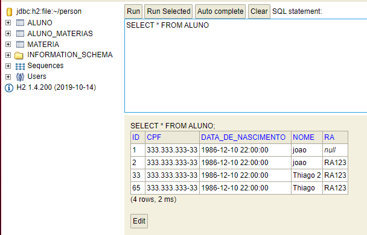
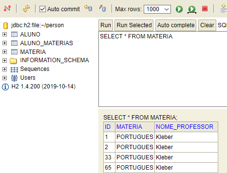
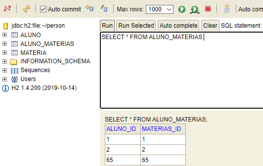
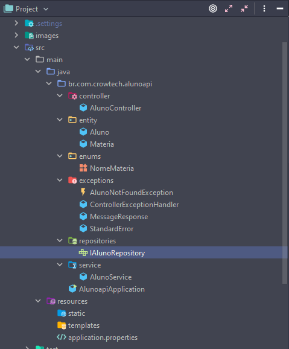

<h1 align="center">Versão 2 do Projeto Person API</h1>

---
<H3>Objetivo: </H3>
<p>Aprenda a construir do zero uma API REST com Spring Boot para cadastro e gerenciamento de pessoas de uma organização. Praticar os principais conceitos do estilo arquitetural REST envolvidos durante o desenvolvimento do projeto.<p>

<h3>Configurações</h3>

 - Maven 3.8.1;
 - Spring Boot 2.5.3;
 - Java 11+.

<h3>Dependências utilizadas</h3>

 - Spring Boot Actuator;
 - Spring Boot DevTools;
 - Spring WEB;
 - Spring Data JPA;
 - H2 Database;
 - Lombok.

Foi usado no projeto a seguinte configuração do application.properties a seguir:
```
spring.h2.console.enabled=true
spring.h2.console.path=/h2-console

# Datasource
spring.datasource.url=jdbc:h2:file:~/person
spring.datasource.driverClassName=org.h2.Driver
spring.datasource.username=sa
spring.datasource.password=


spring.jpa.show-sql=true
spring.jpa.properties.hibernate.format_sql=true


#Corrigindo erro no banco de dados acusando falta de um DB
spring.jpa.hibernate.ddl-auto=update
```

Essa configuração tenho como padrão para todos os projetos que utilizo um banco em memoria, mudando somente o endereço do file ou utilizando ele somente em memoria, alterando assim a url como abaixo:
```
spring.datasource.url=jdbc:h2:mem:test
```

Com isso conseguiremos uma interface JPA e referenciar ela como uma anotação @Repository:
```java
@Repository
public interface IAlunoRepository extends JpaRepository<Aluno,Integer> {

}
```
Podendo assim ser criados todas as Entidades, Serviços e Controllers do projeto, gerando assim banco relational 1xN conforme imagem:
<b>Tabela Aluno</b>



<b>Tabela Materias</b>



<b>Tabela Aluno-Materia</b>



Após a confirmação de que o banco subiu corretamente e o JPA está conseguindo criar ele, podemos então seguir para a criação das demais classes:

- Enums;
- Exceptions

A Estrutura Final do Projeto Ficou conforme abaixo:



---
<H2>Conclusão</h2>
<p>Ao final deste projeto, foi aprendido e colocado em pratica conceitos Rest, as principais annotations (@GetMapping, @PostMapping, @PutMapping e @DeleteMapping).
Fora isso foi reduzido algumas redundancias do projeto original, gerando assim um código mais <i>'clean'</i> e de facil manutenção.</p>